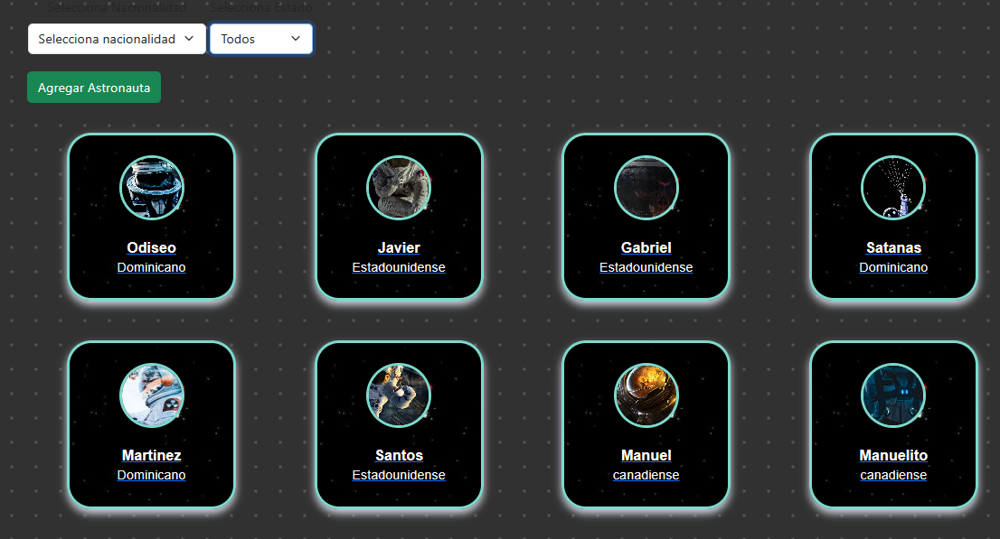
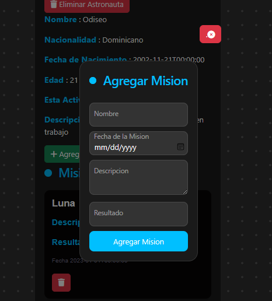
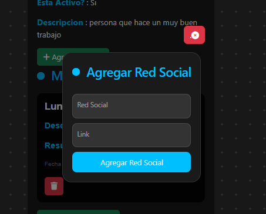
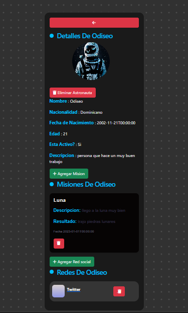

# Aplicación de Astronautas

Esta es una aplicación desarrollada en React para el frontend y .NET para el backend, utilizando MySQL como base de datos y dapper como orm. La aplicación presenta un listado de astronautas con información detallada, incluyendo fotos, nombre, nacionalidad, descripción, fecha de nacimiento, edad, redes sociales y un botón para acceder a más detalles sobre las misiones espaciales en las que participaron.

## Características

- **Listado de Astronautas:** Visualiza un listado completo de astronautas con sus datos principales.
- 

- **Agregar misiones y redes sociales en los detalles **

#Agregar Mision
 
3Agregar Red Social
  

- **Detalles de Misiones:** Accede a detalles específicos sobre las misiones espaciales en las que participó cada astronauta.
 

- **Filtrado por Nacionalidad:** Utiliza un filtro para mostrar astronautas específicos por su nacionalidad.

- **Estado Actual:** Identifica el estado actual de cada astronauta, indicando si está activo o no.

- ** (Adiccional) Eliminación de Misiones y Redes Sociales:** Ahora puedes eliminar misiones y redes sociales asociadas a cada astronauta.

## Instrucciones de Ejecución

### Backend (.NET)

1. Abre la solución en Visual Studio.

2. Asegúrate de tener una instancia de MySQL ejecutándose.

3. Configura la cadena de conexión en el archivo `Connection.cs` en el proyecto Controlador en la carpeta Context.

4. Ejecuta la aplicación.

### Frontend (React)

1. Abre una terminal en la carpeta del proyecto de React.

2. Instala las dependencias usando el comando `npm install`.

3. Configura la URL del backend en el archivo de configuración si es necesario.

4. Ejecuta la aplicación con `npm run dev`.

## Problemas y Sugerencias

Si encuentras algún problema o tienes sugerencias para mejorar la aplicación, por favor abre un [issue](https://github.com/tu-usuario/tu-proyecto/issues).

¡Gracias por contribuir!

